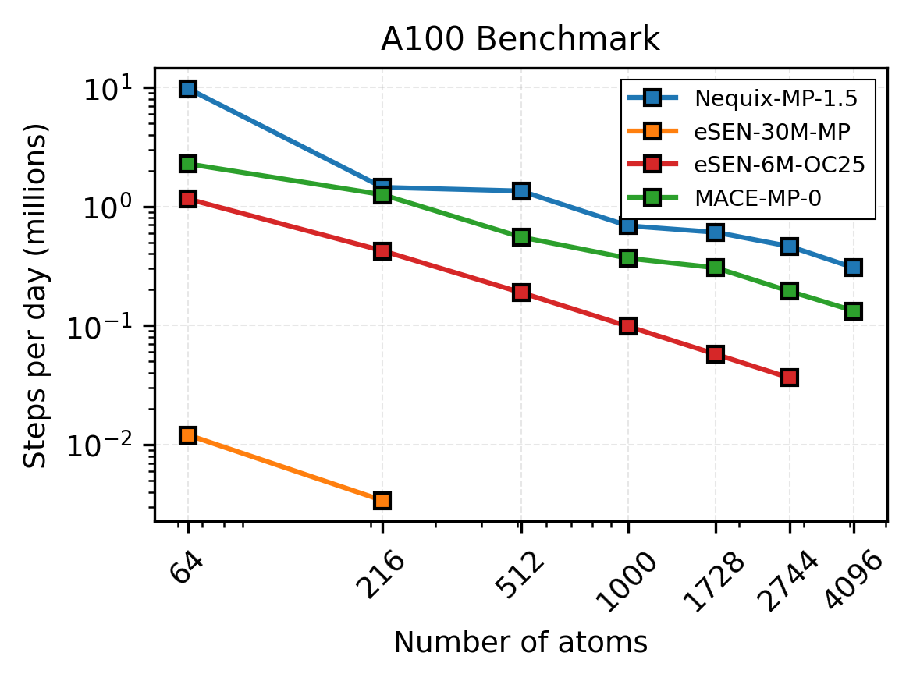
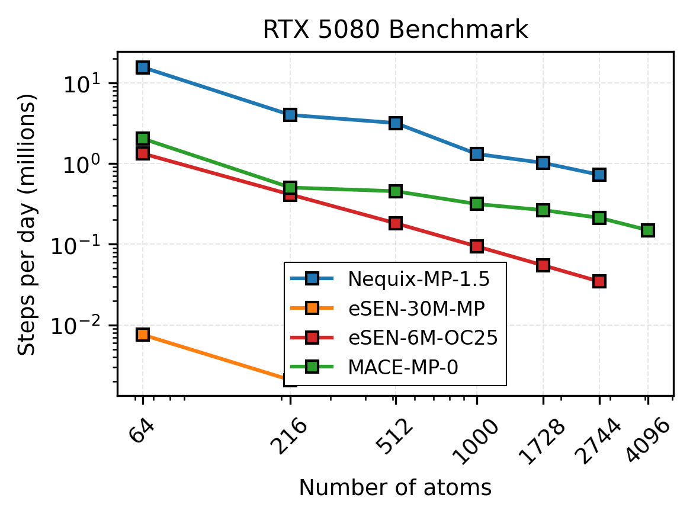

# Matbench-Speed

- SevenNet, GRACE, Nequix, MACE scripts should run out of box.]
- For eSEN the checkpoint needs to be downloaded from [hugging face](https://huggingface.co/facebook/OMAT24). 
- For NequIP the model needs ``torch==2.9.0``, ``openequivariance==0.4.1`` and needs to be compiled on the target hardware using the command

    ```bash
    nequip-compile nequip.net:mir-group/NequIP-OAM-L:0.1 mir-group__NequIP-OAM-L__0.1.nequip.pt2 --mode aotinductor --device cuda --target ase --modifiers enable_OpenEquivariance
    ```
    Note that are using the OMat24 model instead of MPTrj since it contains the kernels, and we confirmed that the hyperparams are the same.

# Benchmarks (Updated 10/26/2025)



